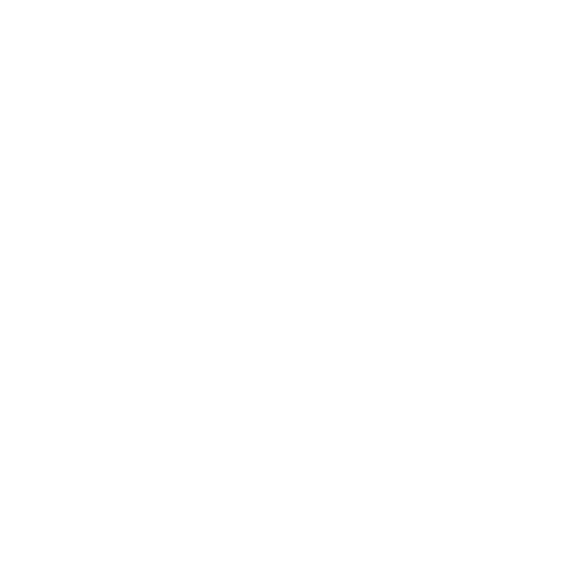

<div align="center">

#  Portfolio-MAR

### Junior Web Developer

[](https://vuejs.org/)
[](https://vite.dev/)
[](https://tailwindcss.com/)
[](https://daisyui.com/)
[](https://developer.mozilla.org/en-US/docs/Web/JavaScript)
[](https://www.php.net/)
[](https://laravel.com/)
[](https://www.mysql.com/)
[](https://github.com/kodokTemler)

Website portofolio pribadi untuk menampilkan profil, keahlian, dan proyek-proyek yang telah dikerjakan.

---

</div>

## Tentang

Portfolio-MAR adalah website portofolio pribadi yang dibangun menggunakan **Vue 3** dengan **Composition API** dan **Vite**. Website ini dirancang untuk memberikan pengalaman visual yang menarik dengan antarmuka modern, responsif, dan dukungan multibahasa (Indonesia & Inggris).

Website ini menampilkan profil singkat, daftar keahlian teknis, dan showcase proyek-proyek unggulan yang telah diselesaikan.

## Teknologi yang Digunakan

| Kategori | Teknologi |
|----------|-----------|
| **Frontend** | Vue 3 (Composition API, `<script setup>`), Tailwind CSS v4, daisyUI v5 |
| **Build Tool** | Vite 8 |
| **Backend** | Laravel 11, PHP 8 |
| **Database** | MySQL 8 |
| **Tools** | Git, GitHub, Bootstrap |

## Fitur

- **Dark & Light Mode** — Toggle tema gelap/terang yang tersimpan di localStorage
- **Multibahasa (i18n)** — Dukungan bahasa Indonesia dan Inggris
- **Responsive Design** — Tampilan optimal di desktop, tablet, dan mobile
- **Scroll Animation** — Animasi transisi saat scrolling menggunakan IntersectionObserver
- **Loading Screen** — Efek loading dengan progress bar saat pertama kali membuka halaman
- **Smooth Navigation** — Navigasi anchor-based dengan smooth scrolling

## Memulai

### Prasyarat

- Node.js `^20.19.0` atau `>=22.12.0`
- npm (atau package manager lainnya)

### Instalasi

```bash
# Clone repository
git clone https://github.com/kodokTemler/portofolio-vue.git

# Masuk ke direktori project
cd portofolio-vue

# Instalasi dependensi
npm install
```

### Perintah yang Tersedia

```bash
npm run dev      # Jalankan server development dengan HMR
npm run build    # Build untuk production ke direktori dist/
npm run preview  # Preview hasil build production
```

## Struktur Proyek

```
portofolio-vue/
├── public/
│   ├── favicon.ico
│   ├── logoMAR.png
│   └── images/              # Gambar screenshot proyek
│       ├── stunting.webp
│       ├── lapanganbola.webp
│       ├── kopikenangan.webp
│       └── batupute.webp
├── src/
│   ├── assets/
│   │   ├── main.css         # Semua gaya (Tailwind + daisyUI + custom CSS)
│   │   ├── base.css
│   │   ├── profile.webp     # Foto profil
│   │   ├── aboutme.webp     # Foto tentang saya
│   │   └── logoMAR.png      # Logo MAR
│   ├── composables/
│   │   ├── useI18n.js       # Composable untuk multibahasa
│   │   └── useScrollAnimation.js  # Composable untuk animasi scroll
│   ├── translations.js      # Data terjemahan (EN/ID)
│   ├── App.vue              # Seluruh aplikasi (Single File Component)
│   └── main.js              # Entry point
├── index.html
├── vite.config.js
├── package.json
└── README.md
```

## Proyek Unggulan

| Proyek | Deskripsi | Teknologi |
|--------|-----------|-----------|
| **Stunting Prediction System** | Sistem prediksi stunting menggunakan Gaussian Naive Bayes | Laravel, Python, MySQL, Bootstrap |
| **Football Field Booking** | Sistem pemesanan lapangan futsal online dengan penjadwalan & pembayaran | PHP, Bootstrap, MySQL, Mitrans, Tailwind CSS |
| **Memories Coffee Shop** | Aplikasi web untuk kedai kopi dalam mengelola menu dan pesanan | JavaScript, Bootstrap, PHP, MySQL |
| **Batupute Village Website** | Situs web resmi desa Batupute, Kabupaten Barru | Laravel, PHP, MySQL, Bootstrap |

## Kontak

- **GitHub** — [kodokTemler](https://github.com/kodokTemler)
- **LinkedIn** — [Muhammad Abdul Rozzaq](https://www.linkedin.com/in/muhammad-abdul-rozzaq-436174398/)
- **Email** — [abdulrozzaqmuh@gmail.com](mailto:abdulrozzaqmuh@gmail.com)

---

<div align="center">

&copy; 2026 Muhammad Abdul Rozzaq. Hak cipta dilindungi.

</div>
